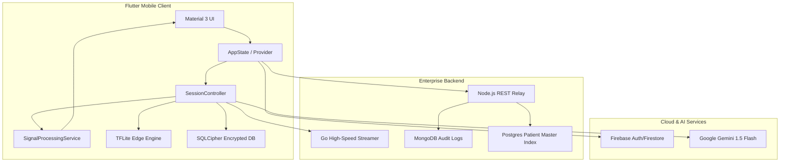

# NeuroSignal AI Architecture Diagram

```mermaid
graph TD
    subgraph Mobile_Client [Flutter Mobile Client]
        UI[Material 3 UI]
        State[AppState / Provider]
        Monitor[SessionController]
        DSP[SignalProcessingService]
        TFLite[TFLite Edge Engine]
        DB_Local[SQLCipher Encrypted DB]
    end

    subgraph Backend_Infrastructure [Enterprise Backend]
        NodeJS[Node.js REST Relay]
        GoServer[Go High-Speed Streamer]
        MongoDB[MongoDB Audit Logs]
        PostgreSQL[Postgres Patient Master Index]
    end

    subgraph Cloud_Services [Cloud & AI Services]
        Firebase[Firebase Auth/Firestore]
        Gemini[Google Gemini 1.5 Flash]
    end

    %% Data Flows
    UI --> State
    State --> Monitor
    Monitor --> DSP
    DSP --> UI
    Monitor --> TFLite
    Monitor --> DB_Local

    Monitor --> GoServer
    State --> NodeJS
    NodeJS --> PostgreSQL
    NodeJS --> MongoDB

    State --> Firebase
    Monitor --> Gemini
```
