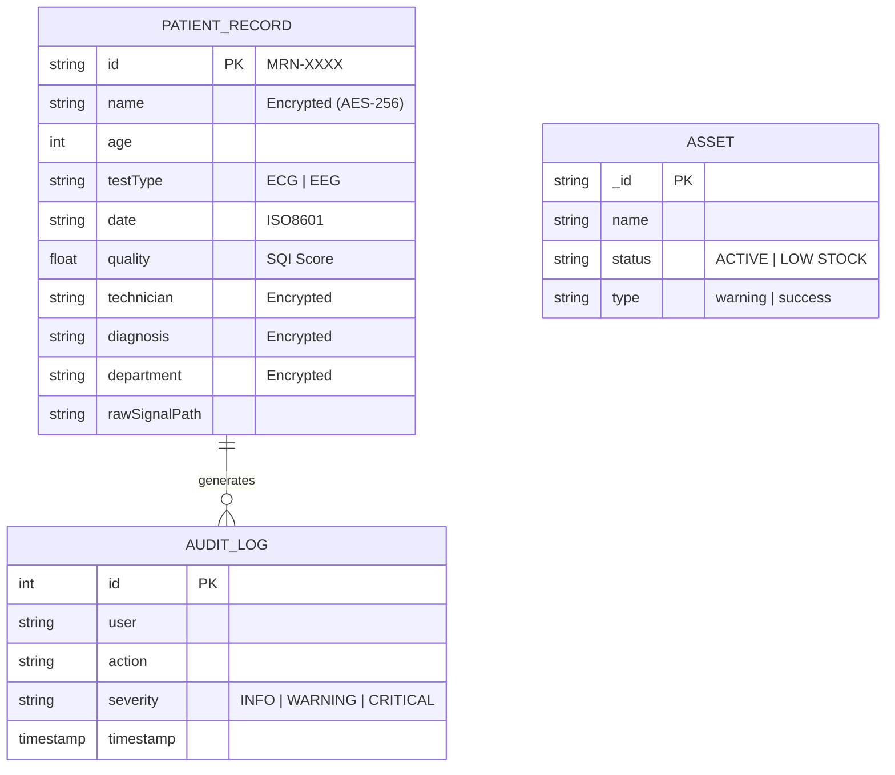

# NeuroSignal AI Database Schema

```mermaid
erDiagram
    PATIENT_RECORD {
        string id PK "MRN-XXXX"
        string name "Encrypted (AES-256)"
        int age
        string testType "ECG | EEG"
        string date "ISO8601"
        float quality "SQI Score"
        string technician "Encrypted"
        string diagnosis "Encrypted"
        string department "Encrypted"
        string rawSignalPath
    }

    AUDIT_LOG {
        int id PK
        string user
        string action
        string severity "INFO | WARNING | CRITICAL"
        timestamp timestamp
    }

    ASSET {
        string _id PK
        string name
        string status "ACTIVE | LOW STOCK"
        string type "warning | success"
    }

    PATIENT_RECORD ||--o{ AUDIT_LOG : generates
```
