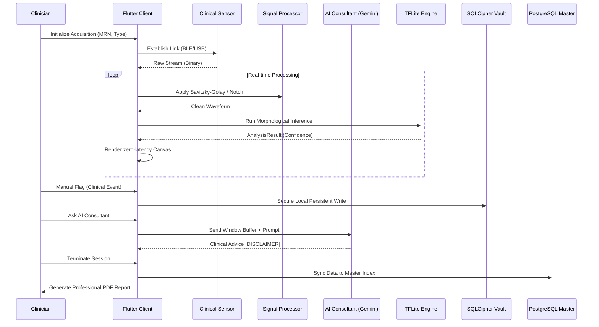

# Sequence Diagram: Clinical Data Acquisition & AI Analysis

```mermaid
sequenceDiagram
    participant User as Clinician
    participant App as Flutter Client
    participant Hardware as Clinical Sensor
    participant DSP as Signal Processor
    participant AI as AI Consultant (Gemini)
    participant Edge as TFLite Engine
    participant DB as SQLCipher Vault
    participant Cloud as PostgreSQL Master

    User->>App: Initialize Acquisition (MRN, Type)
    App->>Hardware: Establish Link (BLE/USB)
    Hardware-->>App: Raw Stream (Binary)
    
    loop Real-time Processing
        App->>DSP: Apply Savitzky-Golay / Notch
        DSP-->>App: Clean Waveform
        App->>Edge: Run Morphological Inference
        Edge-->>App: AnalysisResult (Confidence)
        App->>App: Render zero-latency Canvas
    end

    User->>App: Manual Flag (Clinical Event)
    App->>DB: Secure Local Persistent Write

    User->>App: Ask AI Consultant
    App->>AI: Send Window Buffer + Prompt
    AI-->>App: Clinical Advice [DISCLAIMER]
    
    User->>App: Terminate Session
    App->>Cloud: Sync Data to Master Index
    App-->>User: Generate Professional PDF Report
```
D:\pdd\docs\technical\product_readiness_report.md
